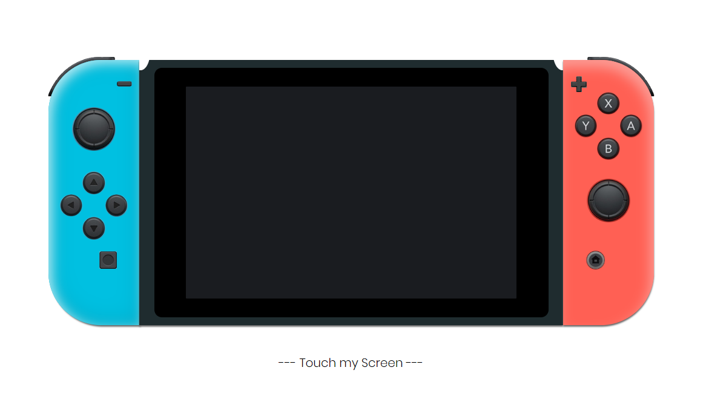

## Nintendo Switch

> Practicando HTML y CSS.

Creando una consola Nintendo Switch hiperrealista usando solo 'FLEXBOX' y 'GRID' para ubicar todas las partes que la componen.

El resultado [aquí](https://perisdev.github.io/nintendoSwitch/)

## screenshots

